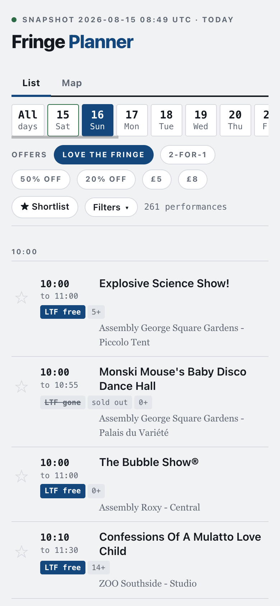

# Fringe Planner

An Edinburgh Fringe planner that works with no signal, which is the normal
condition of a phone in Edinburgh in August. Add it to your home screen once on
wifi and the whole programme, plus a real map of the city, stays on the device.

**[https://joelvardy.github.io/fringe-planner/](https://joelvardy.github.io/fringe-planner/)**

43,587 performances across 3,969 shows at 533 venues, 3 August to 1 September 2026.

## Install it on an iPhone or iPad

1. Open [https://joelvardy.github.io/fringe-planner/](https://joelvardy.github.io/fringe-planner/) in Safari. It has to be Safari - no other browser on
   iOS can add a web app to the home screen
2. Wait on wifi for it to finish loading. It's ~10.7 MB, most of that the
   offline map, and it all downloads up front so none of it is needed later
3. Tap Share, then **Add to Home Screen**, then **Add**
4. Open it from the home screen icon. It runs full screen with no browser
   chrome, and works in aeroplane mode

Step 2 is the one that matters. Loading the page is what caches it, so if you
add it to the home screen before it has finished, the first offline opening
comes up empty.

**Android:** Chrome, menu, *Install app*.
**Desktop:** open the link, then use the install button in the address bar of
Chrome or Edge.

## Using it

- **Love the Fringe is on by default.** The chip filters to performances with a
  £0 Love the Fringe band. Turn it off to see the whole Fringe programme.
  `LTF free` means the band is still available, `LTF gone` means that
  performance has sold its allocation
- **Clear every offer chip to see everything.** Offers exist only on the shows
  sold through edfest, so the rest of the programme appears when no chip is
  ticked - with no price list, and a booking link to edfringe.com instead
- **Tap ★ to shortlist a performance.** The shortlist is stored on the device,
  so each phone keeps its own. *Export shortlist* produces a code to paste into
  *Import shortlist* on another phone
- **Tap any row** for the description, content warnings, the price list where
  there is one, a booking link, and *What's near here?*
- **Past performances are hidden**, so what you see is what you can still get
  to. Tick *Past shows* to bring them back
- **Set Near and a radius** (250 m to 2 km) to show only what's in walking
  distance. It anchors on GPS or on a venue, and GPS works with no data
  connection
- **The Map tab** is a real OpenStreetMap of central Edinburgh, held on the
  device. Venue circles are sized by how many performances match your filters,
  and tapping one filters the list to that venue

## Staleness and updating

The listings are a snapshot taken **2026-08-22 18:01 UTC**. Availability moves fast
in the last fortnight of the festival, so times, prices, and Love the Fringe
availability were true then and may not be now. Check with the venue before
relying on it. The header shows the snapshot date and its age permanently, so
this is never a surprise.

When a newer snapshot is published, opening the app on wifi offers an Update
banner. Taking it re-downloads the whole ~10.7 MB, so give it a moment on a slow
connection. Offline, the app carries on with what it already has.

## About this repository

It's generated. It holds the built site only, the pipeline that produces it is
kept private, and anything edited here is overwritten by the next deploy.

Show listings, descriptions, and prices come from the Edinburgh Festival Fringe
programme, via edfest.com and edfringe.com.

## Map data

The bundled `edinburgh.pmtiles` is an extract of OpenStreetMap data,
© OpenStreetMap contributors, available under the
[Open Database Licence](https://www.openstreetmap.org/copyright). The basemap
style derives from [Protomaps basemaps](https://github.com/protomaps/basemaps)
(BSD-3-Clause). Rendering uses [MapLibre GL JS](https://maplibre.org/)
(BSD-3-Clause) and [pmtiles](https://github.com/protomaps/PMTiles)
(BSD-3-Clause), both vendored under `vendor/` so the app fetches nothing at
runtime.
